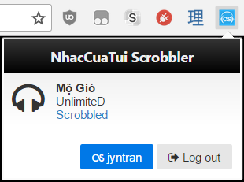

# NhacCuaTui Scrobbler

Chrome extension that scrobbles music from [NhacCuaTui.com](http://www.nhaccuatui.com) to [Last.fm](http://www.last.fm)
- Adds current track to Last.fm profile under Scrobbling Now 
- Scrobbles after the halfway mark on a song
- Please keep only one open tab of playing music on NhacCuaTui

Feel free to contribute or post issues to the [GitHub repository](https://github.com/jyntran/nhaccuatui-scrobbler).

## User Installation

1. Download the .crx here: http://jyntran.ca/chrome/nhaccuatui-scrobbler.crx
2. Open Chrome and go to `chrome://extensions`
3. Drag and drop the .crx into Chrome
4. Accept permissions to install the extension
5. Click on the extension button, then click Log In

## Note for Developers

- You will need a Last.fm API key and secret to run it: http://www.last.fm/api
- Place your key and secret in `api/config.js`. The file `config.sample.js` is provided as a template.

## License

[MIT](license.txt)